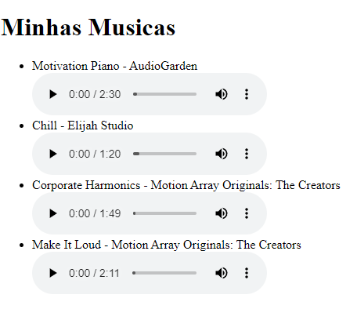

# MVC com Rest

Trabalho prático da disciplina de Arquitetura de BackEnd - Pós-Graduação em Arquitetura de Soluções da **PUC Minas**

Esse projeto foi desenvolvido utilizando Node.js e Express.js - O desenvolvimento foi realizado utilizando o estilo arquitetural MVC Rest

Nome dos integrantes do grupo:

- Leandro Moreira da Silva
- Leon Wagner Farias de Souza
- Jonas Lima de Amorim
- Junia Almeida Matos Boechat
- Samara Luiza da Silva

---

## <a> Índice </a>

1. [Sobre MVC Rest](#sobre-mvc-rest)
    + [Estrutura de pastas](#estrutura-pastas)
        - [Models](#models)
        - [Views](#views)
        - [Controllers](#controllers)
2. [Sobre o Express.js](#sobre-o-expressjs)
3. [Inicie o servidor](#inicie-o-servidor)
4. [Testes](#testes)
    + [Rotas](#rotas)
        - [GET](#get)
        - [GET by ID](#get-by-id)
        - [POST](#post)
        - [DELETE by ID](#delete-by-id)

---

## <a name="sobre-mvc-rest">Sobre MVC Rest </a>

A combinação do MVC com REST é uma abordagem comum para
construir APIs web, onde o MVC é usado para estruturar a aplicação em camadas e o REST é usado para projetar a comunicação entre o cliente e o servidor.

### <a name="estrutura-pastas"> Estrutura de pastas </a>

A aplicação foi estruturada nas pastas `controllers`, `models`, `views`.

A pasta `models` contém os modelos lógicos de dados da aplicação, o modelo de dados `Music`.

A pasta `views` contém as informações que são apresentadas ao usuário como a lista de músicas e o player de música.

A pasta `controllers` contém os scripts que possuem as rotas e que atuam como intermediário entre a Model e a View. Os controles da aplicação são `musicControllers` e `aboutControllers`.

``` shell
│   app.js
├───controllers
│       aboutController.js
│       musicController.js
│
├───files
│       Chill.mp3
│       CorporateHarmonics.mp3
│       IndiePop.mp3
│       MakeItLoud.mp3
│       MotivationPiano.mp3
│
├───models
│       music.js
│
└───views
        musicList.ejs

```

#### <a name="model"> Models </a>

Foi criado um arquivo contendo o modelo de dados da aplicação. O modelo possui informações sobre o titulo da música, o cantor, o caminho do arquivo, o ano e o álbum. Segue o modelo abaixo:

```javascript

class Music {
    constructor(id, title, singer, path, year, album) {
      this.id = id;
      this.title = title;
      this.singer = singer;
      this.path = path;
      this.year = year;
      this.album = album;
    }
  }

```

#### <a name="views"> Views </a>

Uma visualização simples da lista de músicas foi criado. A lista é criada de forma dinâmica, de acordo com o número de músicas incluídas na base de dados. O reprodutor de áudio padrão do HTML5 foi utilizado para reproduzir as músicas.



#### <a name="controllers"> Controllers </a>

No `controller` de músicas foram criadas rotas para a recuperação da lista de música, rota para recuperar somente uma música utilizando um identificador único, rota para recuperar o arquivo da música, rota para a exclusão utilizando o identificador úvico e rota para inclusão de uma nova música.

No `controller` de informações sobre o projeto, foi criado uma única rota para recuperar os integrantes do grupo.

---

## <a name="sobre-express">Sobre o Express.js </a>

Para implementar essa aplicação foi utilizado o Express.js, ele fornece o sistema de roteamento e recursos simplificados que podem ser utilizado para facilitar a implementação de aplicativos backend.

As rotas criadas nos arquivos `controllers` foram exportadas utilizando o comando `module.exports = router;`, depois os `controllers` foram incluídos na aplicação por meio do trecho de código abaixo:

``` javascript
app.use('/', musicController);
app.use('/', aboutController);
```

---

## <a name="iniciar-servidor">Inicie o Servidor </a>

Faça download do repositório

Navegue até a pasta

Instale as dependências utilizando o comando abaixo:

```cmd
npm install
```

No terminal, execute o seguinte comando para iniciar o servidor:

```cmd
node app.js
```

## <a name="testes">Testes </a>

Os testes podem ser realizados por meio do aplicativo PostMan, cmd ou um navegador.

### <a name="rotas">Rotas </a>

#### <a name="get">GET </a>

GET /musics

Lista de musicas completas

```cmd
curl --location 'http://localhost:3000/musics'

```

GET /about

Sobre os integrantes do grupo

```cmd
curl --location 'http://localhost:3000/about'

```

#### <a name="get-id">GET by ID </a>

GET /music/id

Carrega as informações de uma música específica.

```cmd
curl --location 'http://localhost:3000/music/Chill.mp3'
```

GET /files/id

Faz download do arquivo de uma música específica.

```cmd
curl --location 'http://localhost:3000/files/Chill.mp3'
```

#### <a name="post">POST </a>

POST /music

Inclui uma música na lista de músicas.

```json
curl --location 'http://localhost:3000/music' \
--header 'Content-Type: application/json' \
--data '{
    "id": "IndiePop.mp3",
    "title": "Indie Pop",
    "singer": "MusicFinder",
    "path": "./files/IndiePop.mp3",
    "year": "2022",
    "album": "Royalty Free Music"
}'

```

#### <a name="delete-id">DELETE by ID </a>

DELETE /music/id

Apaga um música específica.

```json
curl --location --request DELETE 'http://localhost:3000/music/Chill.mp3'
```
